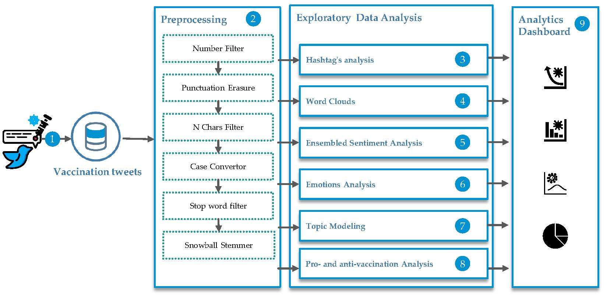

# Tweets-Analysis-Framework-for-Covid-19-and-Covid-19-Vaccines
This framework gathers and analyzes Twitter data using machine learning and deep learning algorithms to identify negative sentiment and misleading information related to COVID-19 and COVID-19 vaccines

The goal of the framework is to do seven types of analysis on COVID-19-related tweets from social media sites like Twitter. Data preprocessing includes getting rid of data that isn't important, getting rid of stop words, and stemming. The analyses include exploratory data analysis, sentiment analysis, emotion analysis, topic modeling, and both pro- and anti-vaccination analysis. With hashtag and word cloud analysis, you can find out what people talk about most. Ensemble sentiment analysis is a way to make sentiment analysis more accurate. Emotion analysis helps us understand how people feel and act about vaccinations. Topic modeling finds the most popular topics, and pro- and anti-vaccination analysis sorts tweets by how they feel about vaccines. Overall, this framework uses machine learning and deep learning algorithms to look at tweets about the COVID-19 vaccine. This helps healthcare professionals, public health agencies, and policymakers raise awareness and come up with ways to help.
